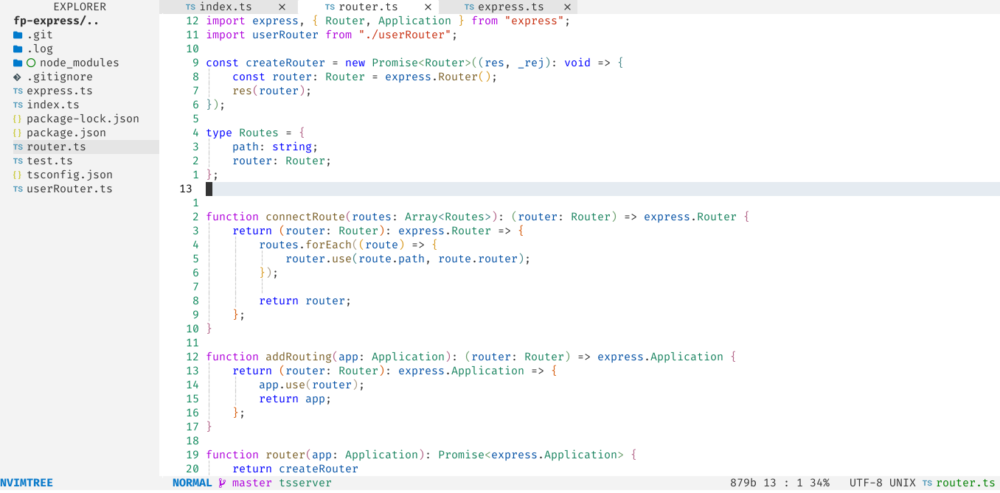

<h1 align="center">herman_colorscheme.nvim</h1>

herman_colorscheme.nvim (former codedark.nvim) a Lua port of [vim-code-dark](https://github.com/tomasiser/vim-code-dark) colorscheme for [neovim](https://neovim.io/) with herman_colorscheme light and dark theme

## Dark 


## Light


## #️ Supported Plugins
- [LSP](https://github.com/neovim/nvim-lspconfig)
- [Treesitter](https://github.com/nvim-treesitter/nvim-treesitter)
- [nvim-compe](https://github.com/hrsh7th/nvim-compe)
- [Telescope](https://github.com/nvim-telescope/telescope.nvim)
- [NvimTree](https://github.com/kyazdani42/nvim-tree.lua)
- [BufferLine](https://github.com/akinsho/nvim-bufferline.lua)
- [Git Signs](https://github.com/lewis6991/gitsigns.nvim)
- [Git Gutter](https://github.com/airblade/vim-gitgutter)
- [Lualine](https://github.com/hoob3rt/lualine.nvim)
- [Indent Blankline](https://github.com/lukas-reineke/indent-blankline.nvim)


## ⬇️ Installation

Install via package manager

 ```lua
 -- Using Packer:
 use 'Hermanverschooten/herman_colorscheme.nvim'
 ```

```vim
" Using Vim-Plug:
Plug 'Hermanverschooten/herman_colorscheme.nvim'
```
## 🚀 Usage

```lua
-- Lua:
-- For dark theme
vim.g.herman_colorscheme_style = "dark"
-- For light theme
vim.g.herman_colorscheme_style = "light"
vim.cmd[[colorscheme herman_colorscheme]]

```
```vim
" Vim-Script:
" For dark theme
let g:herman_colorscheme_style = "dark"
" For light theme
let g:herman_colorscheme_style = "light"
colorscheme herman_colorscheme
```

If you are using [`lualine`](https://github.com/hoob3rt/lualine.nvim), you can also enable the provided theme:


```lua
require('lualine').setup {
  options = {
    -- ... 
    theme = 'herman_colorscheme'
    -- ... 
  }
}'
```

[nvim-bufferline.lua](https://github.com/akinsho/nvim-bufferline.lua)  setup for exact match as screen shots

```lua
-- Buffer line setup
require'bufferline'.setup{
	options = {
		indicator_icon = ' ',
    	buffer_close_icon = '',
    	modified_icon = '●',
    	close_icon = '',
		close_command = "Bdelete %d",
		right_mouse_command = "Bdelete! %d",
		left_trunc_marker = '',
    	right_trunc_marker = '',
		offsets = {{filetype = "NvimTree", text = "EXPLORER", text_align = "center"}},
		show_tab_indicators = true,
		show_close_icon = false
	},
	highlights = {
		fill = {
			guifg = {attribute = "fg", highlight = "Normal"},
			guibg = {attribute = "bg", highlight = "StatusLineNC"},
		},
		background = {
			guifg = {attribute = "fg", highlight = "Normal"},
			guibg = {attribute = "bg", highlight = "StatusLine"}
		},
		buffer_visible = {
			gui = "",
            guifg = {attribute = "fg", highlight="Normal"},
            guibg = {attribute = "bg", highlight = "Normal"}
		},
		buffer_selected = {
			gui = "",
            guifg = {attribute = "fg", highlight="Normal"},
            guibg = {attribute = "bg", highlight = "Normal"}
		},
		separator = {
			guifg = {attribute = "bg", highlight = "Normal"},
			guibg = {attribute = "bg", highlight = "StatusLine"},
		},
		separator_selected = {
            guifg = {attribute = "fg", highlight="Special"},
            guibg = {attribute = "bg", highlight = "Normal"}
		},
		separator_visible = {
			guifg = {attribute = "fg", highlight = "Normal"},
			guibg = {attribute = "bg", highlight = "StatusLineNC"},
		},
		close_button = {
			guifg = {attribute = "fg", highlight = "Normal"},
			guibg = {attribute = "bg", highlight = "StatusLine"}
		},
		close_button_selected = {
            guifg = {attribute = "fg", highlight="normal"},
            guibg = {attribute = "bg", highlight = "normal"}
		},
		close_button_visible = {
            guifg = {attribute = "fg", highlight="normal"},
            guibg = {attribute = "bg", highlight = "normal"}
		},

	}
}

```

## Switching theme 
```
:lua require('herman_colorscheme').change_style("light") 
:lua require('herman_colorscheme').change_style("dark") 
```

